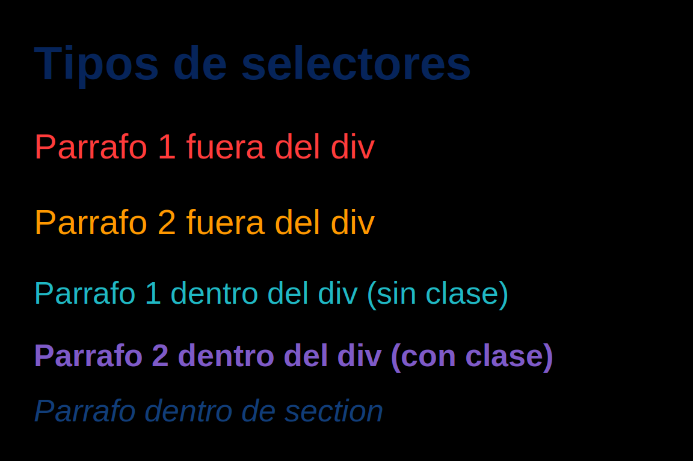

# Practica guiada: Selectores CSS basicos y combinados

## 1. Introduccion

Este proyecto se ha preparado como material de aula para aprender a usar selectores CSS sobre una estructura HTML sencilla.
La actividad permite identificar como cambia el estilo de un elemento segun su posicion en el documento, su clase o su nivel de anidacion.

## 2. Objetivos de aprendizaje

Al finalizar la practica, deberia ser capaz de:

1. Construir una estructura HTML con etiquetas anidadas.
2. Enlazar correctamente un archivo CSS externo.
3. Aplicar selectores de etiqueta, clase, descendencia y pseudo-clases estructurales.
4. Diferenciar visualmente elementos similares (`<p>`) usando reglas CSS especificas.

## 3. Archivos del proyecto

- `index.html`: contiene la estructura semantica del ejercicio.
- `index.css`: contiene todas las reglas de estilo.
- `resultado-final.svg`: imagen de referencia del resultado esperado.

## 4. Estructura requerida en HTML

El ejercicio solicita exactamente:

1. Dos elementos `<p>` fuera de un `<div>`.
2. Un `<div>` que incluya dos `<p>` (uno con clase y otro sin clase).
3. Un `<section>` dentro del `<div>`, con un `<p>` en su interior.

Fragmento clave de `index.html`:

```html
<p>Parrafo 1 fuera del div</p>
<p>Parrafo 2 fuera del div</p>

<div class="contenedor">
  <p>Parrafo 1 dentro del div (sin clase)</p>
  <p class="especial">Parrafo 2 dentro del div (con clase)</p>
  <section>
    <p>Parrafo dentro de section</p>
  </section>
</div>
```

## 5. Enlace entre HTML y CSS

En el `<head>` de `index.html` se incluye:

```html
<link rel="stylesheet" href="index.css">
```

Este paso separa estructura (HTML) y presentacion (CSS), que es una buena practica academica y profesional.

## 6. Selectores usados y su interpretacion

En `index.css` se aplican reglas diferentes a cada parrafo:

```css
body > p:first-of-type { ... }
body > p:nth-of-type(2) { ... }
div > p:not(.especial) { ... }
div > p.especial { ... }
div section p { ... }
```

Interpretacion didactica:

1. `body > p:first-of-type`: selecciona el primer `<p>` hijo directo de `body`.
2. `body > p:nth-of-type(2)`: selecciona el segundo `<p>` hijo directo de `body`.
3. `div > p:not(.especial)`: selecciona el `<p>` hijo directo de `div` que no tiene la clase `especial`.
4. `div > p.especial`: selecciona el `<p>` hijo directo de `div` con clase `especial`.
5. `div section p`: selecciona el `<p>` que esta dentro de `section`, y ese `section` esta dentro de `div`.

Ademas de `color`, se usan propiedades como `font-size`, `font-weight` y `font-style` para reforzar la diferenciacion visual.

## 7. Resultado visual esperado



## 8. Verificacion paso a paso (checklist)

1. Abrir `index.html` en un navegador.
2. Comprobar que existen 5 parrafos en total.
3. Verificar que cada parrafo tiene color distinto.
4. Confirmar que el parrafo con clase `especial` aparece en negrita.
5. Confirmar que el parrafo dentro de `section` aparece en cursiva.

## 9. Errores frecuentes en clase

1. Olvidar enlazar `index.css` en el `<head>`.
2. Escribir mal la clase (`especial`) y perder el estilo esperado.
3. Confundir `div > p` (hijo directo) con `div p` (descendiente).
4. Cambiar el orden de los `<p>` y afectar selectores como `:first-of-type` o `:nth-of-type(2)`.

## 10. Conclusion

Esta practica muestra como la seleccion precisa de elementos en CSS permite controlar el estilo de forma clara y escalable, incluso cuando varios elementos comparten la misma etiqueta HTML.
